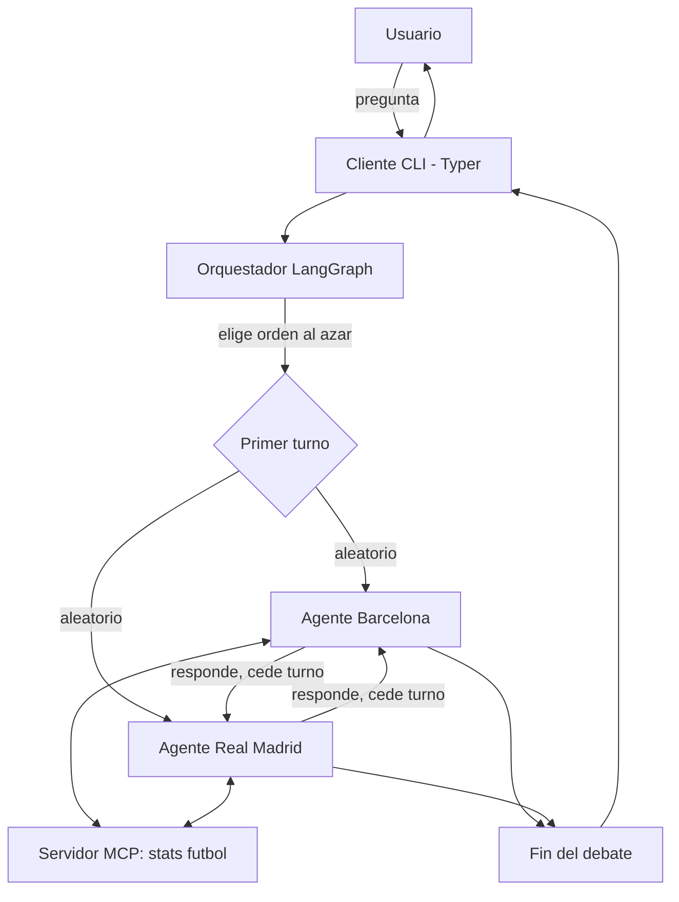

# Arquitectura

Sistema multiagente donde un cliente CLI hace preguntas de futbol y dos
agentes reactivos (Barcelona y Real Madrid) responden por turnos,
argumentando siempre a favor de su equipo, apoyandose en herramientas
externas expuestas por un servidor MCP.

## Diagrama de flujo

## Componentes

- **Cliente CLI** (`src/cli`, `main.py`): recibe la pregunta del usuario,
  dispara el orquestador y muestra el debate formateado.
- **Orquestador** (`src/orchestrator`): grafo de estados construido con
  LangGraph. Decide aleatoriamente quien habla primero y alterna turnos
  hasta completar el numero de rondas configurado.
- **Agentes reactivos** (`src/agents`): un agente ReAct por equipo
  (`create_react_agent` de LangGraph). Cada uno tiene un prompt de
  sistema con sesgo fijo hacia su equipo y usa las herramientas MCP para
  fundamentar sus respuestas con datos reales.
- **Servidor MCP** (`src/mcp_server`): expone herramientas de
  estadisticas de futbol (`get_team_stats`, `get_player_stats`,
  `compare_players`, `get_head_to_head`) via el protocolo MCP (stdio).
  Los agentes se conectan como clientes MCP mediante
  `langchain-mcp-adapters`.

## Flujo de una pregunta

1. El usuario escribe una pregunta en la CLI.
2. El orquestador crea el estado inicial: elige aleatoriamente el orden
   de turnos (`["barcelona", "real_madrid"]` barajado).
3. El grafo enruta al primer agente, que consulta el servidor MCP si
   necesita datos, y responde.
4. El grafo cede el turno al otro agente, que ve la respuesta previa y
   puede rebatirla, siempre defendiendo su equipo.
5. Se repite hasta completar `rounds` (por defecto 1 ronda = 1 turno cada
   uno) y el resultado se imprime en la CLI.

## Decisiones clave

- **LangGraph** como motor de orquestacion: el turno se modela como un
  grafo de estados con enrutamiento condicional, ideal para alternancia
  estricta y facil de extender (mas rondas, mas agentes, moderador, etc).
- **MCP** como protocolo de herramientas: desacopla los datos de futbol
  de la logica del agente. El Dev 3 puede reemplazar `src/mcp_server` por
  una API real sin tocar agentes ni orquestador.
- **Agentes reactivos (ReAct)**: cada agente decide en cada paso si
  necesita una herramienta antes de responder, sin planificacion previa
  compleja, cumpliendo el requisito de "tipo reactivo".

## Publicacion en redes sociales (`src/social/`, Fase 2 — Dev Harold)

El debate ya generado por el orquestador se puede publicar ademas en una
red social externa, sin tocar `src/orchestrator/` ni `src/agents/`.

- **`DebatePublisher`** (`src/social/base.py`): contrato comun — un
  metodo `publish(debate: Debate) -> PublishResult`. `Debate`/`DebateTurn`
  (`src/social/models.py`) son una forma estable y minima del debate,
  adaptada del dict crudo del orquestador via `debate_from_result(...)`,
  para que un publisher nunca dependa de la estructura interna del grafo.
- **`registry.py`**: mapea nombre de plataforma -> clase publisher.
  Agregar una red social nueva = crear `XPublisher(DebatePublisher)` +
  una linea en el registry; el CLI no cambia.
- **Redes evaluadas** (ver discusion completa en el issue #7): se
  descarto X/Twitter por no tener tier gratuito de escritura desde 2023.
  Se eligieron 4 candidatas, con distinto estado de implementacion:

  | Plataforma | Estado | Idea |
  |---|---|---|
  | Telegram | **Implementado** | Bot API simple (token via @BotFather), un mensaje por turno encadenado con `reply_to_message_id` al turno anterior. |
  | Reddit | Planeado | `praw`, post inicial + un comentario por turno en cadena de replies. Requiere subreddit propio. |
  | Discord | Planeado | Webhook de canal, un mensaje por turno. |
  | Bluesky | Planeado | AT Protocol (`atproto`), alternativa gratuita a X/Twitter. |

  Los publishers "planeados" ya existen como clase (implementan la
  interfaz) pero `publish()` lanza `NotImplementedError` — la arquitectura
  esta lista para sumarlos sin rediseño, se implementan cuando toque.
- **Uso**: `python main.py ask "..." --publish-to telegram` (o el flag
  equivalente en `chat`). Credenciales en `.env`
  (`TELEGRAM_BOT_TOKEN`, `TELEGRAM_CHAT_ID`).
